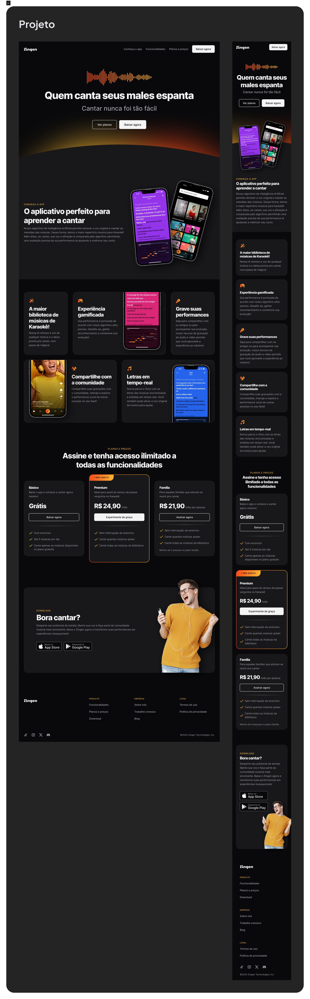

# 🎤 Zingen — App para Aprender a Cantar

**Zingen** é um aplicativo  Web/mobile focado em **ensinar pessoas a cantar do zero ou aprimorar suas habilidades vocais**, de forma prática, acessível e progressiva. A proposta central do app é combinar **técnica vocal**, **treino guiado** e **feedback em tempo real**, tornando o aprendizado mais eficiente e motivador.

---

## 🧭 Sobre a Landing Page

A landing page do **Zingen** foi projetada para **converter visitantes em usuários**, apresentando de forma clara os benefícios do aplicativo, seus principais recursos e a proposta de valor. A navegação é **direta**, com chamadas à ação bem posicionadas e uma comunicação visual alinhada ao universo musical.

O design utiliza **identidade visual moderna**, **cores vibrantes**, **tipografia expressiva** e **elementos visuais sonoros**, criando conexão imediata com o público interessado em canto e música.

---

## 🎶 O que a Landing Page Apresenta

- 🎧 **Headline clara e objetiva**, destacando o aprendizado de canto de forma prática  
- 🎵 **Apresentação do app**: para iniciantes e cantores em evolução  
- 📊 **Feedback em tempo real**, mostrando progresso e desempenho do usuário  
- 📱 **Interface intuitiva**, com experiência pensada para mobile  

---

## 🎯 Objetivo da Landing Page

O principal objetivo é **apresentar o Zingen de forma clara e atrativa**, destacando seus diferenciais e incentivando o visitante a **baixar o aplicativo e iniciar sua jornada vocal**.

---

